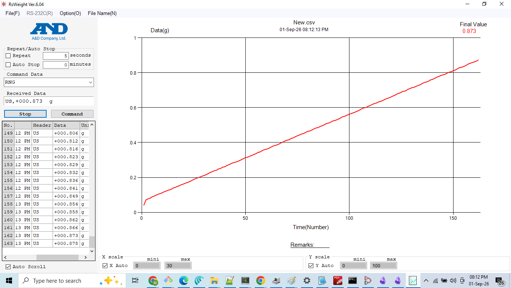

# WeighLink

**Industrial serial-scale integration with compliance logging and workflow automation — A&D protocol over RS232/RS485, tamper-evident audit trail, Postgres storage, and real-time Slack alerting through a self-hosted n8n stack.**

---

## What This Is

WeighLink connects an industrial weighing instrument to your data and workflow
systems. It reads weight data from an **A&D industrial scale** over the serial
line, enforces per-product tolerances, writes an immutable local audit trail,
and forwards stable weighments to a self-hosted automation layer that stores
them in Postgres, alerts on out-of-tolerance results in real time, and produces
scheduled summaries.

It fills a gap in the market between two ends. At one end are free serial
utilities — 232key (keyboard emulation, typing serial data as keystrokes) and
WinCT (A&D's own data-transfer utility) — which move data but add no compliance
or audit layer. At the other end are enterprise systems such as Yaveon and V5,
which are full ERP-integrated suites. WeighLink combines three things those
options do not offer together: config-driven protocol parsing, a tamper-evident
compliance/audit layer, and workflow automation — open, lightweight, and
vendor-neutral.

## Reference Instrument, Extensible by Design

The delivered implementation speaks the **A&D standard ASCII protocol**
(17-character format, 9600 baud, 7-E-1), validated against A&D's own RsWeight
6.04 software (see Interoperability Proof below). A&D is the proven reference
instrument.

Because the protocol is defined in a JSON configuration rather than hard-coded,
the parser is instrument-agnostic: supporting Mettler Toledo (MT-SICS), Ohaus,
or Sartorius (SBI) is a configuration entry, not a code change. Those additional
protocols are a designed-in seam, not yet delivered — A&D is what is built and
validated today.

## Interoperability Proof

A&D RsWeight 6.04 receiving and correctly parsing data from the WeighLink scale
simulator over virtual COM ports (com0com):



## System Overview

WeighLink runs in three tiers:

```
  EDGE (local machine at the instrument)          SELF-HOSTED STACK (VPS, Docker)         SURFACE
┌──────────────────────────────────────┐        ┌──────────────────────────────────┐   ┌──────────┐
│ serial read → parse → WeighmentRecord │        │ n8n workflows (authenticated):   │   │  Slack   │
│ → tolerance check → audit log (local) │──HTTP─→│  • Receive + Store → Postgres    │──→│  alerts  │
│ → webhook push (stable readings)      │  POST  │  • Tolerance Alert (on FAIL)     │   │  (live)  │
│                                        │  +auth │  • Daily Summary (scheduled)     │   └──────────┘
│ Python · pyserial · config-driven     │        │  Postgres · Redis · Traefik TLS  │
└──────────────────────────────────────┘        └──────────────────────────────────┘
```

1. **Edge / local** — the Python pipeline runs at the instrument: reads the
   serial stream, parses it, builds a compliant record, checks tolerance, and
   writes the tamper-evident local audit log. Stable weighments are POSTed to
   the stack over an authenticated webhook.

2. **Self-hosted stack** — a containerized n8n + Postgres + Redis + Traefik
   deployment on a VPS. WeighLink's data and automation layer was built into
   this stack: a dedicated Postgres database (isolated from n8n's own), the
   weighment schema, and three live workflows.

3. **Surface** — Slack receives real-time tolerance-failure alerts and the
   scheduled daily summary. It is the visible notification channel on top of the
   stack, not the storage or logic layer.

## Capabilities (built and validated)

**Instrument layer**
- Config-driven serial parser, A&D reference implementation (RS232/RS485).
- Scale simulator with realistic settling dynamics, vibration, and tare —
  interop-validated against A&D RsWeight 6.04.
- Fill-controller GUI with proportional closed-loop motor logic
  (bulk → micro-trickle → target).

**Compliance layer**
- Every weighment carries: timestamp (ISO 8601 UTC), device ID, operator ID,
  lot/batch reference, tolerance result.
- Append-only JSONL audit log with a SHA-256 hash chain for tamper evidence.
- Tolerance engine: configurable min/max per product, PASS / FAIL / NO_RULE,
  decided at the source before any record leaves the machine.

**Data layer (self-hosted, containerized)**
- A dedicated Postgres database built into the existing Dockerized n8n stack,
  isolated from n8n's operational database by both schema and credentials.
- Typed weighment schema with a DB-owned identity and ingest timestamp distinct
  from the weighing timestamp, indexed for the alerting and summary queries.
- Timezone-anchored daily aggregation (operating-day boundary, not server UTC).
- Verified backup/restore path for the weighment database.

**Automation & alerting**
- Self-hosted n8n (queue mode) behind Traefik TLS.
- Authenticated inbound webhook (shared-secret header) — the compliance
  write-endpoint is not open.
- Three live workflows: Receive + Store (persist every weighment),
  Tolerance Alert (Slack message on FAIL, silent on PASS), Daily Summary
  (scheduled aggregate digest to Slack).
- Webhook pusher with retry and exponential backoff; failures are logged, never
  silently dropped.

## Compliance Positioning

WeighLink demonstrates the data architecture required for traceable, auditable
weight records in regulated environments (pharmaceutical, food & beverage,
logistics). Every weighment is timestamped, attributed (device, operator, lot),
tolerance-checked, and hash-chained.

**Boundary of claim:** this is a working reference implementation and
architectural demonstration. It does not claim regulatory certification
(FDA 21 CFR Part 11, FSMA, BRCGS, ISO 22000). Regulatory validation is a
deployment-specific activity tied to a facility's quality management system.

## Validation Status

- **Validated:** end-to-end against the interop-proven simulator — serial parse,
  compliance record, authenticated push, Postgres storage, live Slack alerting,
  and scheduled summary, all running on the self-hosted stack.
- **Not yet built:** physical hardware integration. The next step is an
  Arduino + HX711 + load-cell front end emitting the same A&D ASCII format, at
  which point the instrument layer swaps from simulator to hardware with no
  change to the rest of the pipeline.

## Built With

- **Python 3.x** · **pyserial** — edge pipeline and serial communication
- **n8n** (self-hosted, queue mode) — workflow automation
- **PostgreSQL** — weighment storage and aggregation
- **Docker** — the n8n/Postgres/Redis/Traefik stack (Hostinger-provisioned base;
  WeighLink's database, schema, workflows, auth, and hardening built on top)
- **Traefik** — TLS termination and routing
- **com0com** — virtual COM ports (development/demo)

## Designed-For-Tomorrow Seams (not built in v1)

Each has a named attachment point in the architecture; none requires rework to
add — only new code at a defined seam.

- Physical hardware front end (Arduino + HX711 + load cell)
- RS485 multi-drop bus (device_id field present; bus not implemented)
- Additional protocols (Mettler Toledo MT-SICS, Ohaus, Sartorius SBI)
- Operator authentication beyond manual entry (badge, barcode, LDAP)
- ERP tolerance lookup (currently local config)
- MQTT and direct-ERP output adapters (currently webhook only)
- ERP sync workflow (Odoo, SAP, Business Central — n8n has native nodes)

## Repository Structure

```
weighlink/
├── config/                  Configuration (ports, protocols, tolerances)
│   ├── app_config.example.json   Template — copy to app_config.json (gitignored)
│   ├── protocols/a_and_d.json
│   └── tolerances/demo_product.json
├── simulator/               A&D scale simulator (interop-validated)
├── listener/                Serial reader + config-driven protocol parser
├── controller/              Fill-controller GUI (proportional motor control)
├── compliance/              Weighment records, tolerance engine, audit logger
├── integration/             Webhook pusher (authenticated; n8n / any endpoint)
├── n8n_workflows/           Exported n8n workflow JSON
├── tests/                   Unit tests (compliance, reader, webhook, push)
├── docs/                    Architecture, protocol guide, compliance model, n8n setup
├── data/audit_log/          Runtime audit trail (gitignored)
└── demo/                    Walkthrough script and recording
```

## Documentation

- `docs/architecture.md` — system design, data flow, extensibility seams
- `docs/protocol_guide.md` — the A&D protocol config and how to add another
- `docs/compliance_model.md` — audit chain, hash linkage, tolerance model
- `docs/n8n_setup_guide.md` — standing up the workflow layer

---

*WeighLink — bridging serial instruments to compliant, automated workflows.*
